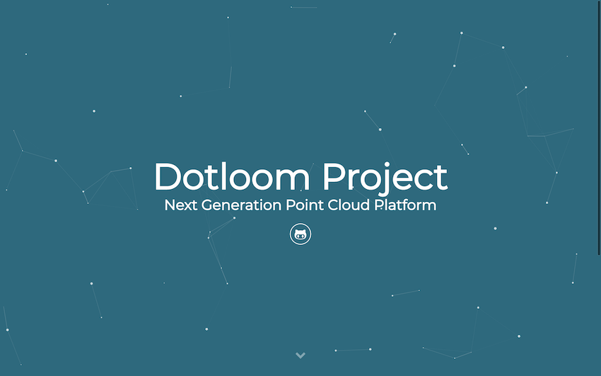
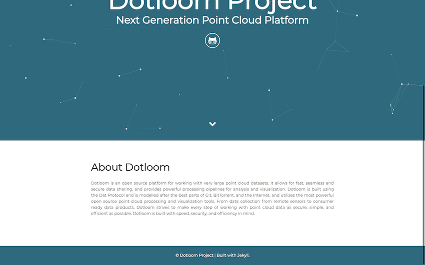

# Dotloom Website

This site uses the [Particle](https://github.com/nrandecker/particle) Jekyll Theme





The Theme features:

- Gulp
- SASS
- Sweet Scroll
- Particle.js
- BrowserSync
- Font Awesome and Devicon icons
- Google Analytics
- Info Customization

## Changing content

Change content in the site by filling in information in the `_config.yml` file. For example, add to the "About" section by adding text to `about:`

```
# Site settings
title: Dotloom Project
description: Next Generation Point Cloud Platform
author: Dotloom Project

# Page Information
about: <add information about the project here>

...
```

## Running local

To see the site locally, node, ruby, and Jekyll need to be installed.

Then, in the site directory,

- Run `npm install`
- Run `gulp`
